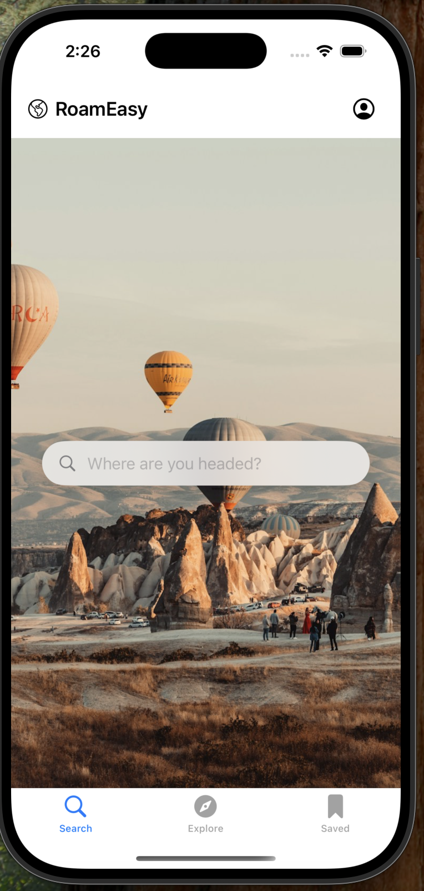
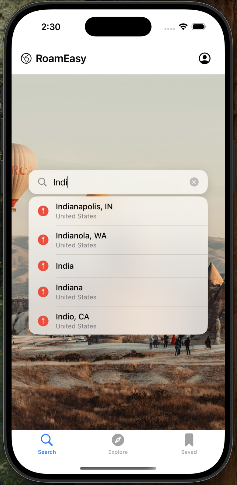
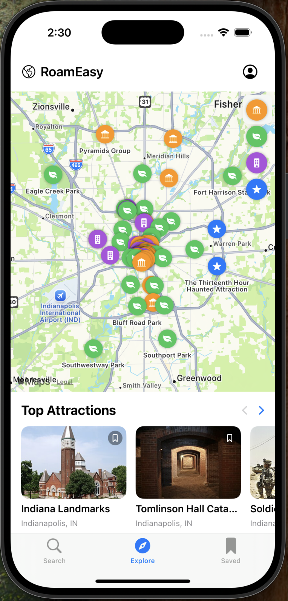
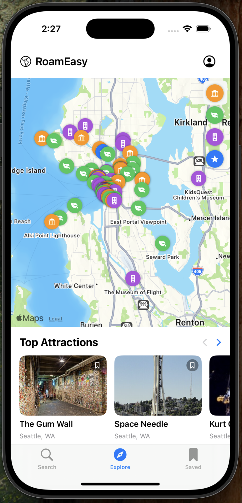
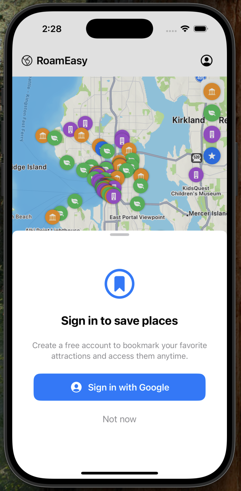
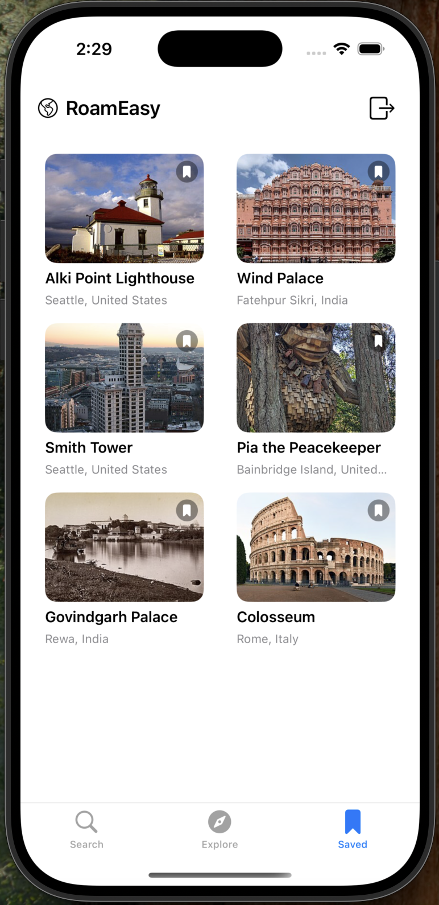

# RoamEasy

A travel companion iOS app that helps users discover and save attractions near any location. Built with SwiftUI, MapKit, and a clean MVVM architecture.

## Features

- **Explore** — Search any city and discover nearby attractions on an interactive map with categorized pins (parks, museums, restaurants, etc.)
- **Save Places** — Bookmark attractions to a personal collection, synced to a backend API with local caching via SwiftData
- **Google Sign-In** — Authenticate with Google to persist saved places across devices
- **Search Autocomplete** — Type-ahead suggestions powered by MapKit's `MKLocalSearchCompleter`

## A Visual Tour

| Home | Search | Explore by Search |
|:----:|:------:|:-----------------:|
|  |  |  |

| Explore Nearby | Sign In | Saved Places |
|:-------------------:|:-------:|:------------:|
|  |  |  |

## Architecture

```
RoamEasy/
├── Models/              # Attraction, SavedPlaceDTO, NetworkError, CachedSavedPlace (SwiftData)
├── Services/            # Network, auth, image, location, and search services
│   └── Protocols/       # Protocol abstractions for DI and testability
├── ViewModels/          # SavedPlacesManager, AttractionsViewModel (@MainActor ObservableObject)
├── Views/               # SwiftUI views, decomposed ExploreView
│   ├── Explore/         # MapSection, AttractionsCarousel, ExploreView
│   └── Components/      # Shared UI components
└── Configuration/       # AppConfiguration (environment-based API URL)
```

**Key patterns:**
- Protocol-based dependency injection for all service boundaries
- SwiftData caching for instant loads and background sync
- Typed error handling with `NetworkError` enum
- View decomposition — large views broken into focused reusable subcomponents

## Tech Stack

- SwiftUI + iOS 17+
- MapKit (MKLocalSearch, annotations, camera positioning)
- SwiftData (local caching)
- Google Sign-In (authentication)
- URLSession (networking)
- SwiftLint (code quality)

## Build & Run

Requires Xcode 16+ and an iOS 17+ simulator or device.

```bash
# Build
xcodebuild -scheme RoamEasy -destination 'platform=iOS Simulator,name=iPhone 16' build

# Run tests
xcodebuild -scheme RoamEasy -destination 'platform=iOS Simulator,name=iPhone 16' test
```

## Backend

The app communicates with a REST API at `https://api.roameasyapp.com` for saved places persistence. Endpoints:

| Method | Path | Description |
|--------|------|-------------|
| GET | `/ios/saved-places?userId=<value>` | Fetch saved places |
| POST | `/ios/saved-places` | Save a place |
| DELETE | `/ios/saved-places` | Delete a place |
